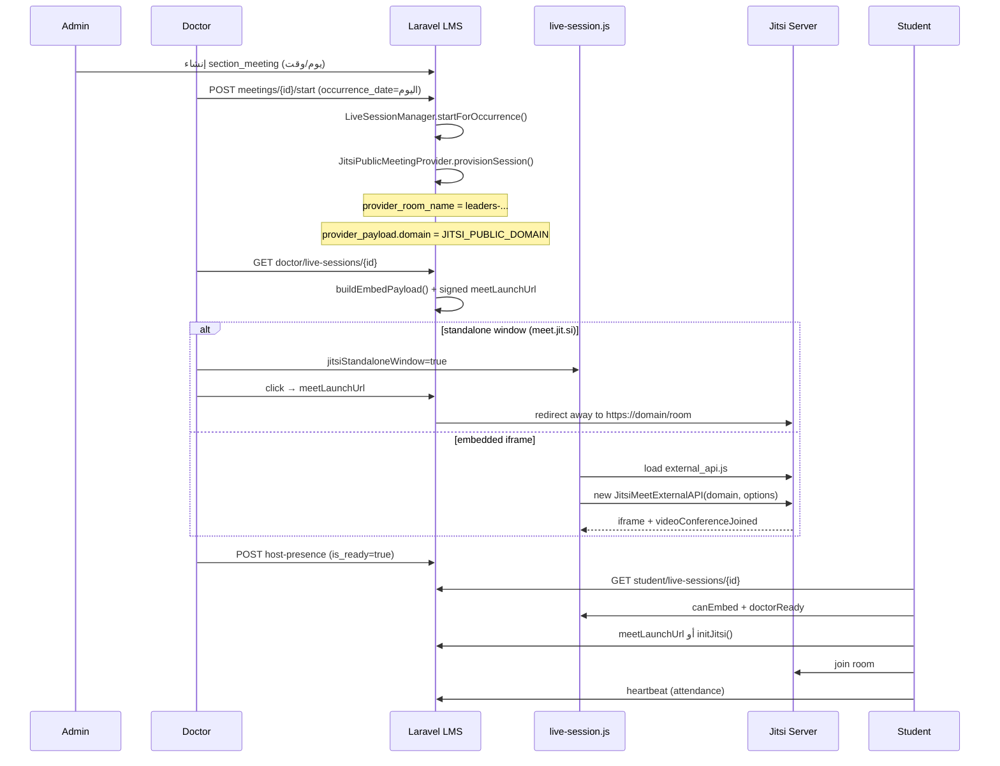

# تحليل تكامل Jitsi — مشروع أكاديمية ليدرز

**التاريخ:** 30 مايو 2026  
**المسار:** `C:\xampp\htdocs\leaders`  
**خادم Jitsi المستهدف:** `https://meet.leaders-academy.net`  
**الحالة:** تحليل فقط — لم يُجرَ أي تعديل على الكود بعد

---

## 1. ملخص تنفيذي

المشروع **مُجهَّز مسبقاً** لتكامل Jitsi عبر بنية Provider واضحة. النطاق يُقرأ من متغير البيئة `JITSI_PUBLIC_DOMAIN` (وليس `JITSI_DOMAIN` كما طُلب في المتطلبات — يُوصى بإضافة alias أو توحيد الاسم).

**الوضع الحالي:** ملف `.env` المحلي **لا يحتوي** على أي متغيرات `JITSI_*` أو `MEETING_*`، لذا يعمل النظام على القيم الافتراضية في `config/meetings.php` أي **`meet.jit.si`**.

**الخبر الجيد:** لا حاجة لإعادة بناء التكامل من الصفر. الانتقال إلى الخادم الخاص يتطلب أساساً:
1. تحديث متغيرات البيئة
2. إزالة `meet.jit.si` من قائمة النطاقات التي تُجبر وضع «نافذة مستقلة»
3. تحديث النصوص الثابتة التي تذكر `meet.jit.si`
4. (اختياري لكن مُوصى به) تفعيل JWT على الخادم الخاص
5. معالجة الجلسات الحية القديمة التي خزّنت `domain: meet.jit.si` داخل `provider_payload`

---

## 2. نتائج البحث في المشروع

### 2.1 `meet.jit.si`

| الملف | السطر/الموقع | الاستخدام |
|-------|-------------|-----------|
| `config/meetings.php` | 6, 11, 21, 31, 46 | القيمة الافتراضية + تعليقات |
| `.env.example` | 21, 23, 30, 32, 41 | توثيق وقيم افتراضية |
| `app/Services/Meetings/JitsiPublicMeetingProvider.php` | 32, 60 | fallback في `config()` |
| `app/Services/Meetings/JitsiJwtTokenBuilder.php` | 39–40 | تعطيل JWT على meet.jit.si |
| `app/Services/Meetings/MeetingStandaloneWindowHelper.php` | 9 | تعليق |
| `public/assets/js/live-session.js` | 88 | رسالة خطأ أذونات الكاميرا/الميكروفون |
| `resources/views/doctor/live_sessions/show.blade.php` | 75, 90 | نصائح للمحاضر (عند `show_operator_tips`) |

### 2.2 `Jitsi` / `jitsi`

الملفات الأساسية:

| الملف | الدور |
|-------|------|
| `app/Services/Meetings/JitsiPublicMeetingProvider.php` | إنشاء الغرف، بناء payload التضمين، روابط URL |
| `app/Services/Meetings/JitsiJwtTokenBuilder.php` | JWT للخادم الخاص / JaaS |
| `app/Services/Meetings/MeetingStandaloneWindowHelper.php` | قرار: تضمين iframe أم نافذة مستقلة |
| `app/Services/Meetings/MeetingProviderManager.php` | توجيه المزود (`jitsi_public`) |
| `app/Services/Meetings/LiveSessionManager.php` | بدء/إغلاق/إنهاء الجلسات |
| `app/Services/Meetings/LiveSessionAttendanceService.php` | حضور + `jitsi_participant_id` |
| `app/Services/Meetings/MeetingOccurrenceService.php` | حساب مواعيد المحاضرات المتكررة |
| `config/meetings.php` | إعدادات مركزية |
| `public/assets/js/live-session.js` | واجهة JitsiMeetExternalAPI + تعليقات + حضور |

### 2.3 `JitsiMeetExternalAPI`

**موقع واحد:** `public/assets/js/live-session.js`

- تحميل السكربت: `https://{domain}/external_api.js` (سطر 622)
- تهيئة: `new window.JitsiMeetExternalAPI(config.embedPayload.domain, options)` (سطر 681)
- أحداث: `videoConferenceJoined`, `participantRoleChanged`, `screenSharingStatusChanged`, إلخ.

### 2.4 `iframe`

- يُنشأ تلقائياً بواسطة `JitsiMeetExternalAPI` داخل `#jitsi-meeting-container`
- يُضبط `allow` للكاميرا/الميكروفون/مشاركة الشاشة (سطور 689–695 في `live-session.js`)
- **لا يوجد iframe ثابت** في Blade — التضمين ديناميكي بالكامل

### 2.5 `video conference` / `classroom` / `lecture` / `meeting` / `webinar`

| المصطلح | أين يُستخدم |
|---------|-------------|
| **meeting** | `section_meetings`, `LiveSession`, `SectionMeeting`, جداول admin |
| **lecture / live session** | `live_sessions`, `LiveSessionController`, `live-session.js` |
| **classroom** | غير مستخدم كمصطلح Jitsi — الشعب: `class_sections` |
| **webinar** | غير موجود |
| **virtual university** | صفحة تسويقية `HomeController::virtualUniversity()` — **لا علاقة لها بـ Jitsi** |

### 2.6 Zoom (legacy — خارج نطاق Jitsi)

حقل `zoom_url` في `class_sections` — رابط خارجي اختياري للشعبة، **لا يُستخدم** في نظام `LiveSession` / Jitsi.

---

## 3. الملفات المسؤولة عن دورة حياة المحاضرة

### 3.1 إنشاء جدول المحاضرات (Schedule)

| الملف | الوظيفة |
|-------|---------|
| `app/Http/Controllers/Admin/SemesterSectionController.php` | CRUD لـ `section_meetings` (يوم، وقت، تاريخ) |
| `resources/views/admin/sections/meetings/partials/index_content.blade.php` | واجهة إدارة المواعيد |
| `app/Models/SectionMeeting.php` | نموذج الموعد المتكرر |
| `app/Services/Meetings/MeetingOccurrenceService.php` | تحويل الموعد إلى occurrence لتاريخ محدد |

### 3.2 بدء المحاضرة (Doctor starts session)

| الملف | الوظيفة |
|-------|---------|
| `routes/web.php` | `POST doctor/meetings/{meeting}/start` |
| `app/Http/Controllers/Doctor/LiveSessionController.php` | `start()` — تحقق من اليوم، استدعاء Manager |
| `app/Services/Meetings/LiveSessionManager.php` | `startForOccurrence()` — إنشاء `live_sessions` |
| `app/Services/Meetings/JitsiPublicMeetingProvider.php` | `provisionSession()` — **إنشاء اسم الغرفة** |

### 3.3 إنشاء روابط/غرف Jitsi

| الملف | الوظيفة |
|-------|---------|
| `JitsiPublicMeetingProvider::provisionSession()` | `provider_room_name = leaders-{id}-{section}-{meeting}-{random}` |
| `JitsiPublicMeetingProvider::buildEmbedPayload()` | domain, roomName, jwt, configOverwrite, meetingUrl |
| `JitsiPublicMeetingProvider::standaloneMeetingUrl()` | `https://{domain}/{room}#userInfo.displayName=...` |
| `LiveSessionMeetLaunchController` | redirect موقّع إلى URL النهائي لـ Jitsi |

### 3.4 الانضمام للمحاضرة

| الدور | الملف | المسار |
|------|-------|--------|
| **Doctor — عرض الصفحة** | `Doctor\LiveSessionController::show()` | `GET /doctor/live-sessions/{id}` |
| **Student — عرض الصفحة** | `Student\LiveSessionController::show()` | `GET /student/live-sessions/{id}` |
| **Doctor — بدء من لوحة** | `Doctor\DashboardController` + `doctor/dashboard.blade.php` | |
| **Student — من الجدول** | `Student\ScheduleController` + `student/schedule/index.blade.php` | |
| **Redirect إلى Jitsi** | `LiveSessionMeetLaunchController` | `GET .../live-sessions/{id}/meet` (signed URL) |
| **Frontend** | `public/assets/js/live-session.js` | embed أو standalone |

### 3.5 تضمين Jitsi

| الملف | الوظيفة |
|-------|---------|
| `resources/views/doctor/live_sessions/show.blade.php` | `#jitsi-meeting-container` أو أزرار standalone |
| `resources/views/student/live_sessions/show.blade.php` | `#jitsi-meeting-container` |
| `public/assets/js/live-session.js` | `initJitsi()`, `loadJitsiScript()`, `JitsiMeetExternalAPI` |
| `public/assets/css/style.css` | `.live-session-*` styles |

---

## 4. تدفق العمل الحالي (Workflow)



### 4.1 شروط دخول الطالب

يُتحقق في `LiveSession::canStudentEnter()`:
- `started_at` موجود
- `isDoctorReady()` = true (الدكتور ضغط «السماح للطلاب» أو joined كـ moderator في embed mode)
- `entry_closed_at` = null
- `ended_at` = null
- لم ينتهِ وقت الجدولة

### 4.2 وضعان للعرض

| الوضع | متى | السلوك |
|-------|-----|--------|
| **Embedded** | النطاق **ليس** في `JITSI_STANDALONE_WINDOW_DOMAINS` | iframe داخل LMS عبر External API |
| **Standalone** | النطاق **في** القائمة + `JITSI_PREFER_STANDALONE_WINDOW=true` | زر يفتح tab جديد → signed redirect → Jitsi |

**حالياً:** `meet.jit.si` في القائمة → **دائماً standalone** (بسبب حد 5 دقائق للتضمين على الخادم العام).

**بعد الانتقال:** إذا أُزيل `meet.leaders-academy.net` من القائمة → **تضمين iframe داخل LMS** (السلوك المُفضَّل للخادم الخاص).

---

## 5. كيف تُنشأ الغرف حالياً

```php
// JitsiPublicMeetingProvider::provisionSession()
$liveSession->provider_room_name = sprintf(
    'leaders-%s-%s-%s-%s',
    $liveSession->id,
    $liveSession->section_id,
    $liveSession->section_meeting_id,
    Str::lower(Str::random(18))
);
$payload['domain'] = config('meetings.jitsi_public_domain', 'meet.jit.si');
$payload['room_password'] = Str::random(16);
```

- **اسم الغرفة:** يُخزَّن في `live_sessions.provider_room_name` (unique index)
- **النطاق:** يُخزَّن أيضاً في `live_sessions.provider_payload['domain']`
- **كلمة مرور:** في `provider_payload['room_password']` — تُطبَّق عبر API عند moderator
- **لا يوجد API call** لـ Jitsi لإنشاء الغرفة — Jitsi ينشئها عند أول join (conference on demand)

---

## 6. أين يُستخدم `meet.jit.si` تحديداً

### 6.1 ديناميكياً (عبر config — يتغير بـ `.env`)

- `config('meetings.jitsi_public_domain')` → كل URLs و payloads
- `JITSI_STANDALONE_WINDOW_DOMAINS=meet.jit.si` → يفرض standalone

### 6.2 ثابتاً (hardcoded — يحتاج تعديل)

- `live-session.js:88` — رسالة خطأ
- `doctor/live_sessions/show.blade.php:75,90` — نصائح operator
- Defaults في `config/meetings.php` و `.env.example`
- شرط في `JitsiJwtTokenBuilder` لـ `=== 'meet.jit.si'`

### 6.3 في قاعدة البيانات (جلسات قديمة)

الجلسات التي بدأت سابقاً قد تحتوي:
```json
provider_payload: { "domain": "meet.jit.si", ... }
```
`buildEmbedPayload()` يقرأ `$payload['domain']` **قبل** config — قد تبقى على meet.jit.si حتى تُحدَّث.

---

## 7. خيارات دمج Jitsi (المتاحة والمُوصى بها)

### الخيار A — البنية الحالية + External API (✅ **مُوصى به**)

**ما هو:** `JitsiMeetExternalAPI` + signed redirect + JWT اختياري.

**المزايا:**
- مُنفَّذ بالكامل
- تحكم من LMS (تعليقات، حضور، moderation flags)
- يدعم embed و standalone
- JWT جاهز للخادم الخاص

**العيوب:**
- يحتاج CORS/embedding مسموح على خادم Jitsi
- JWT يحتاج إعداد Prosody على الخادم

### الخيار B — Redirect فقط (بدون External API)

**ما هو:** الاعتماد حصرياً على `LiveSessionMeetLaunchController` + tab جديد.

**المزايا:** أبسط، أقل مشاكل iframe/CORS.

**العيوب:** فقدان moderation من LMS، لا heartbeat تلقائي من Jitsi events، تجربة أقل تكاملاً.

### الخيار C — iframe مباشر (`<iframe src="https://domain/room">`)

**المزايا:** بسيط.

**العيوب:** لا تحكم programmatic، لا events للحضور، prejoin/password أصعب.

### الخيار D — 8x8 JaaS

**ما هو:** مزود SaaS بدلاً من self-hosted.

**العيوب:** تكلفة، يحتاج Provider class جديد — **غير مطلوب** لأن لديكم `meet.leaders-academy.net`.

### التوصية

**الخيار A** — إبقاء البنية الحالية، تغيير الإعدادات والنصوص فقط، مع:
- `JITSI_PUBLIC_DOMAIN=meet.leaders-academy.net`
- إفراغ `JITSI_STANDALONE_WINDOW_DOMAINS` (أو عدم تضمين النطاق الجديد)
- تفعيل JWT إن كان الخادم مُعدّاً لذلك

---

## 8. التعديلات المطلوبة للانتقال إلى `meet.leaders-academy.net`

### 8.1 متغيرات البيئة (`.env`)

```env
MEETING_PROVIDER_DEFAULT=jitsi_public
JITSI_PUBLIC_DOMAIN=meet.leaders-academy.net

# alias مقترح (اختياري — للتوافق مع طلب JITSI_DOMAIN):
# JITSI_DOMAIN=meet.leaders-academy.net

# للخادم الخاص: لا تضع النطاق الجديد هنا → iframe embedding
JITSI_PREFER_STANDALONE_WINDOW=true
JITSI_STANDALONE_WINDOW_DOMAINS=

# JWT — إذا كان الخادم مُفعَّلاً (موصى به للتحكم بالمشرف)
# JITSI_JWT_APP_ID=...
# JITSI_JWT_APP_SECRET=...
# JITSI_JWT_SUB=meet.leaders-academy.net
# JITSI_JWT_AUDIENCE=jitsi
```

**ملاحظة:** المشروع يستخدم `JITSI_PUBLIC_DOMAIN` وليس `JITSI_DOMAIN`. يُقترح إضافة دعم alias في `config/meetings.php`:
```php
'jitsi_public_domain' => env('JITSI_PUBLIC_DOMAIN', env('JITSI_DOMAIN', 'meet.jit.si')),
```

### 8.2 ملفات الكود

| الملف | التعديل |
|-------|---------|
| `.env` | إضافة المتغيرات أعلاه |
| `.env.example` | تحديث القيم والتعليقات |
| `config/meetings.php` | default → `meet.leaders-academy.net` + alias `JITSI_DOMAIN` |
| `JitsiPublicMeetingProvider.php` | إزالة fallback hardcoded أو جعل domain دائماً من config |
| `JitsiJwtTokenBuilder.php` | استبدال شرط `=== 'meet.jit.si'` بفحص «هل JWT مُفعَّل على الخادم» |
| `live-session.js` | رسالة خطأ تستخدم `config.embedPayload.domain` |
| `doctor/live_sessions/show.blade.php` | نصوص operator تستخدم `config('meetings.jitsi_public_domain')` |

### 8.3 قاعدة البيانات

**لا migration جديد مطلوب** لكن يُوصى بـ:

```sql
-- اختياري: تحديث domain في الجلسات النشطة/المستقبلية
UPDATE live_sessions
SET provider_payload = JSON_SET(COALESCE(provider_payload, '{}'), '$.domain', 'meet.leaders-academy.net')
WHERE JSON_UNQUOTE(JSON_EXTRACT(provider_payload, '$.domain')) = 'meet.jit.si';
```

أو في PHP: جعل `buildEmbedPayload()` **دائماً** يستخدم `config('meetings.jitsi_public_domain')` بدلاً من القيمة المخزنة.

### 8.4 إعدادات خادم Jitsi (خارج Laravel)

يجب التحقق على `meet.leaders-academy.net`:

| الإعداد | السبب |
|---------|-------|
| `external_api.js` متاح | `https://meet.leaders-academy.net/external_api.js` |
| Embedding مسموح | iframe من نطاق LMS (`APP_URL`) |
| CORS | طلبات من LMS إن وُجدت |
| JWT (Prosody) | `JITSI_JWT_*` في Laravel |
| TURN/STUN | للشبكات المقيدة |
| HTTPS صالح | الكاميرا/الميكروفون يتطلب secure context |

### 8.5 ما **لا** يجب تعديله

- جداول `live_sessions`, `section_meetings`, إلخ — البنية مناسبة
- `zoom_url` — legacy منفصل
- صفحات virtual university — لا علاقة
- Filament/Voyager assets

---

## 9. خريطة Routes ذات الصلة

```
POST  /doctor/meetings/{meeting}/start          → بدء جلسة
GET   /doctor/live-sessions/{liveSession}       → صفحة المحاضر
GET   /doctor/live-sessions/{liveSession}/meet  → redirect Jitsi (signed)
POST  /doctor/live-sessions/{id}/host-presence  → «أنا المضيف»
POST  /doctor/live-sessions/{id}/close-entry    → إغلاق الدخول
POST  /doctor/live-sessions/{id}/end            → إنهاء

GET   /student/live-sessions/{liveSession}      → صفحة الطالب
GET   /student/live-sessions/{liveSession}/meet → redirect Jitsi (signed)
POST  /student/live-sessions/{id}/heartbeat     → حضور
```

---

## 10. قائمة الملفات المكتشفة (مرجع كامل)

### Backend — Services
- `app/Services/Meetings/JitsiPublicMeetingProvider.php`
- `app/Services/Meetings/JitsiJwtTokenBuilder.php`
- `app/Services/Meetings/MeetingStandaloneWindowHelper.php`
- `app/Services/Meetings/MeetingProviderManager.php`
- `app/Services/Meetings/MeetingProviderInterface.php`
- `app/Services/Meetings/LiveSessionManager.php`
- `app/Services/Meetings/LiveSessionAttendanceService.php`
- `app/Services/Meetings/MeetingOccurrenceService.php`

### Backend — Controllers
- `app/Http/Controllers/Doctor/LiveSessionController.php`
- `app/Http/Controllers/Student/LiveSessionController.php`
- `app/Http/Controllers/LiveSessionMeetLaunchController.php`
- `app/Http/Controllers/Doctor/DashboardController.php`
- `app/Http/Controllers/Student/ScheduleController.php`
- `app/Http/Controllers/Admin/SemesterSectionController.php`

### Backend — Models
- `app/Models/LiveSession.php`
- `app/Models/LiveSessionAttendance.php`
- `app/Models/LiveSessionComment.php`
- `app/Models/LiveSessionCommentBlock.php`
- `app/Models/SectionMeeting.php`

### Config & Migration
- `config/meetings.php`
- `database/migrations/2026_04_08_120000_create_live_session_tables.php`

### Frontend
- `public/assets/js/live-session.js`
- `public/assets/css/style.css` (`.live-session-*`)
- `resources/views/doctor/live_sessions/show.blade.php`
- `resources/views/student/live_sessions/show.blade.php`
- `resources/views/doctor/dashboard.blade.php`
- `resources/views/student/schedule/index.blade.php`
- `resources/views/admin/sections/meetings/partials/index_content.blade.php`

### Environment
- `.env` (فارغ من JITSI حالياً)
- `.env.example`

---

## 11. مخاطر وملاحظات

1. **JWT:** بدون تفعيل JWT على الخادم الخاص، أي شخص يعرف رابط الغرفة قد يدخل (نفس سلوك meet.jit.si).
2. **جلسات قديمة:** `provider_payload.domain` قد يبقى `meet.jit.si` — يجب normalize في الكود أو SQL.
3. **Standalone vs Embed:** إذا بقي `meet.leaders-academy.net` في `JITSI_STANDALONE_WINDOW_DOMAINS` بالخطأ، لن يعمل iframe embedding.
4. **CORS/X-Frame-Options:** الخادم الخاص يجب أن يسمح بتضمين iframe من نطاق LMS.
5. **اختبار محلي:** LMS على `localhost` + Jitsi على HTTPS domain — قد تحتاج `APP_URL` صحيح للـ signed URLs.
6. **لا git repo:** المشروع ليس git repository حالياً — يُقترح backup يدوي أو `git init` قبل التعديلات.

---

## 12. خطة التنفيذ المقترحة (الخطوات 4–8)

بعد موافقتك على هذا التقرير:

1. **Backup:** نسخ المشروع أو `git init` + branch `feature/jitsi-leaders-academy`
2. **Env:** إضافة `JITSI_PUBLIC_DOMAIN=meet.leaders-academy.net` + JWT إن وُجد
3. **Config:** alias `JITSI_DOMAIN`، تحديث defaults
4. **Code:** normalize domain في provider، تحديث نصوص JS/Blade
5. **Cache:** `php artisan config:clear`
6. **Test:** إنشاء غرفة، join doctor/student، صوت/فideo/screen share، console errors
7. **Report:** `laravel-jitsi-integration-report.md`

---

*تم إعداد هذا التقرير دون أي تعديل على ملفات المشروع.*
